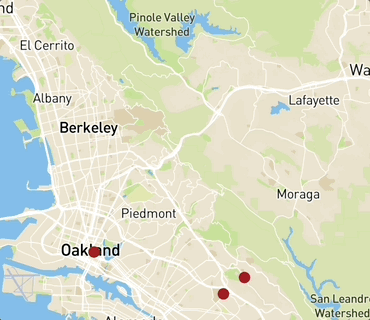
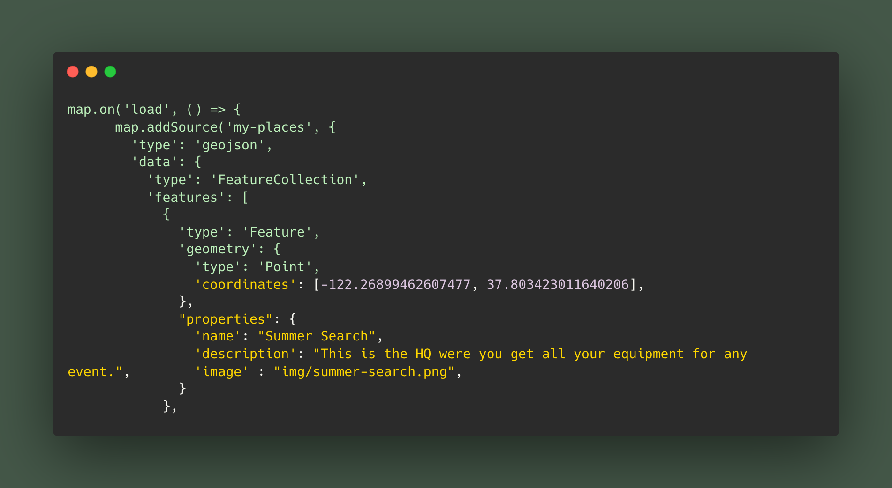

# "Summer In 2025 - Map" App
## What did I build?

I build a map that has three markers set in the coordinates of where that event took place. All events taking place in my summer of 2025.

##
## User can:

User can move around the map and look at what I did and what it ment to me.

##
## Why did I build this?

1. I built this as a type of memory place holder so I can remeber what these places were and what they ment to me.

2. I needed to get credit for a grade so I made this.

##

## Tech Stack:

### 1. Google maps:

I used google maps to locate the coordinates of where each event is located.

### 2. Mapbox GL JS:

I used this library to style and personolized the displayed map. With the "Live Server" and "Markdown All in One" extensions.

### 3. gitHub pages:

I published my app for free on here.

##
## Spotlight:

One feature is how I had added markers to a spicific location with it's cordinate.
 
 
Plus, when you click the marker you can see the name of the place, the discription, and an image.

#
### Code:
#
1. "map.on('load')" allows so the following code appears on the map.
2. "map.addSource( 'my-places', { };)" is the red dot on the screen which allows for the following code to accessed once it is clicked.
3. "'type' : 'geojson'" is what holds all the data.
4. "'data' : {}" is where you imput all the data.
5. "'cordinates' : [#, #]" this holds the cordinates for where the point will be located on the map.
 
Formated (Longitude, Latitude) in minuest and secoonds.
6. " "properties : {}" " this is able to change and personalize the apperance and text.
7. "'name':" This allows to give the marker the title of the location.
8. "'description':" This allows to further explaine what the location is without taking much space (a.k.a smaller text)
9. "'image':" This allows for an image to linked to demostrate any image you need; such as a logo or photo of the location.

